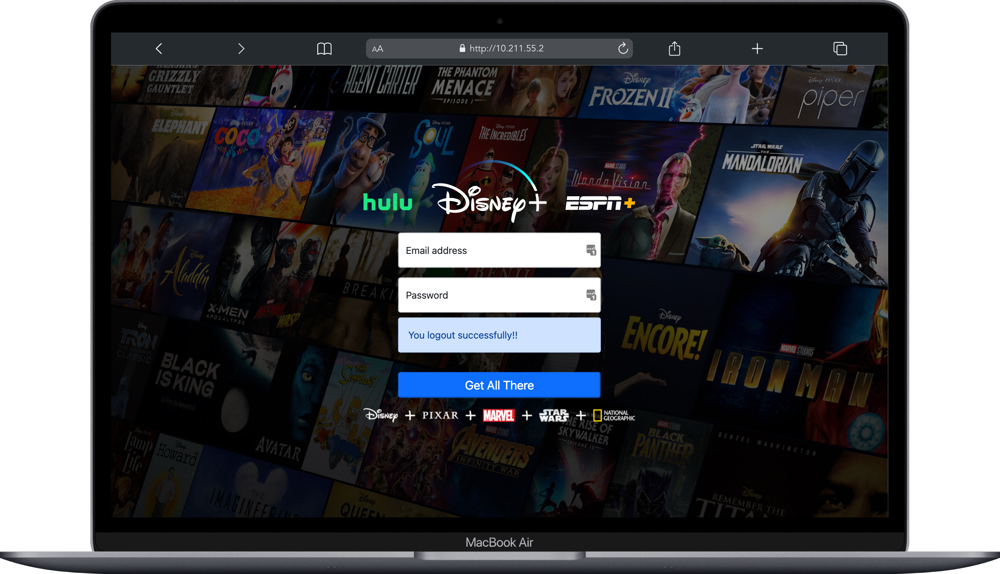
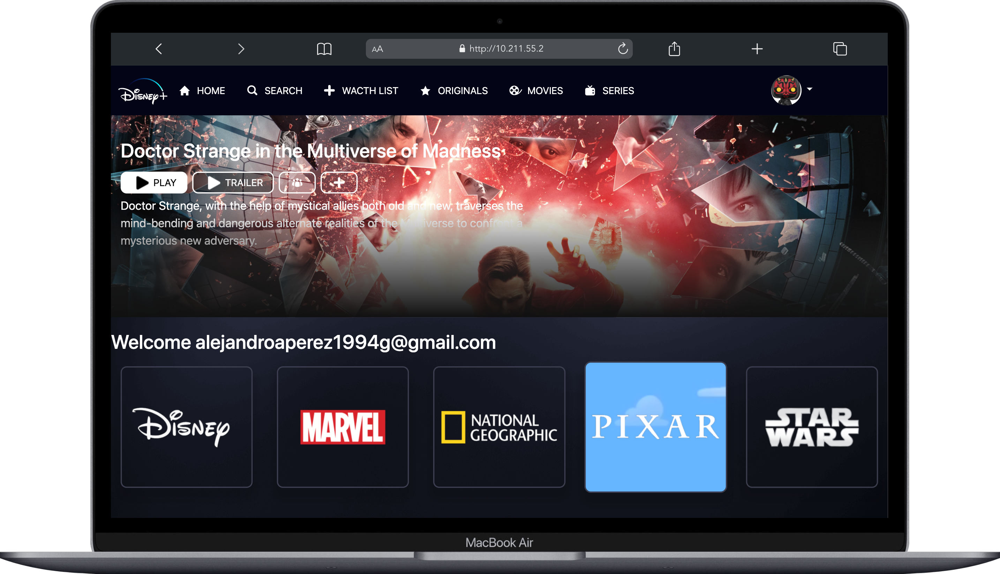

#  PHP Server Environment

##  Authentication System Simulation

###  Description

This application consists of a simulation of the authentication process in a web page. It is made up of a login and a main page to which you will have access after authenticating yourself.

###  Used technology

-  HTML
-  CSS
-  JS
-  PHP
-  GIT
-  BOOTSTRAP

###  Getting Started

**You must clone it inside the htdocs folder of your apache server.**

- Clone the repo

```
  git clone git@github.com:alejandroaperez1994g/environment-php.git
```

- Install dependencies

```
 npm install
```

- Create an .env file where to put your MOVIEDB_API_KEY . To test locally, create a variable api_key and assign yours to it.

###  Preview

   
